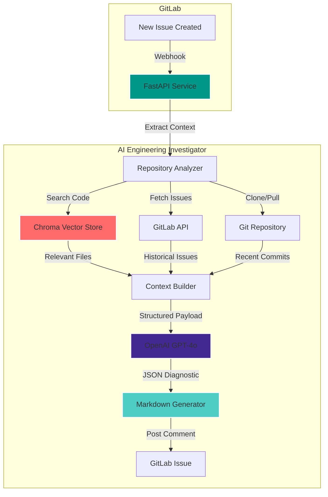

# 🔍 AI Engineering Investigator

<div align="center">

[](https://www.python.org/)
[](https://fastapi.tiangolo.com/)
[](https://openai.com/)
[](https://gitlab.com/)
[](https://www.docker.com/)
[](https://github.com/psf/black)

*AI-powered GitLab issue triage that performs Staff Engineer-level diagnostics automatically* 🛠️

</div>

## Overview 🎯

AI Engineering Investigator is an intelligent issue triage system that integrates directly with GitLab. When a new issue is created, the system automatically analyzes it against the entire repository, historical issues, recent commits, and related code to generate a structured diagnostic report.

Instead of engineers spending hours reproducing issues, searching through the codebase, reviewing prior tickets, and tracing recent changes, this system performs that initial investigative work automatically.

The output is a structured, senior-level engineering diagnostic report posted directly into the GitLab issue.

## Features ✨

- **🧠 Intelligent Analysis**: Uses OpenAI GPT-4o to analyze both bugs and feature requests with full repository context
- **🔍 Semantic Code Search**: Chroma-powered vector search finds relevant files even without exact keyword matches
- **📚 Historical Context**: Automatically links related past issues and recent commits
- **📊 Adaptive Reports**: Generates bug diagnostics OR feature implementation recommendations based on issue type
  - **Bugs**: Root cause analysis, reproduction steps, fix strategies, blast radius
  - **Enhancements**: Requirements analysis, implementation approach, effort estimates, technical details
- **⚡ Real-time Integration**: Triggered automatically via GitLab webhooks on issue creation
- **🐳 Container-Ready**: Fully Dockerized for easy deployment
- **⚙️ Fully Configurable**: Every parameter tunable via environment variables

## Supported Languages 💻

The system analyzes code in the following languages:

- **.NET**: C# (`.cs`), Visual Basic (`.vb`), F# (`.fs`), Razor (`.cshtml`), XAML (`.xaml`)
- **JavaScript/TypeScript**: `.js`, `.ts`
- **Python**: `.py`
- **Java**: `.java`
- **Systems Languages**: C (`.c`), C++ (`.cpp`), Rust (`.rs`), Go (`.go`)
- **Web/Scripting**: PHP (`.php`), Ruby (`.rb`)
- **Headers**: `.h`

> **Note:** Additional language support can be easily added by extending the file extensions in `src/services/repo_analyzer.py`

## Architecture 🏗️



### Components

| Component | Description |
|-----------|-------------|
| 🔄 Webhook Listener | FastAPI endpoint that receives and validates GitLab webhook events |
| 🌐 Repository Analyzer | Clones/pulls repositories and extracts relevant code context |
| 📊 Semantic Search | Chroma vector database for finding relevant code via embeddings |
| 💾 Context Builder | Aggregates repository, issues, and commit data into structured context |
| 🔐 OpenAI Integration | GPT-4o reasoning with structured JSON output schema |
| 📝 Report Generator | Renders diagnostic reports in clean, structured Markdown |

## Prerequisites 📋

- Python >= 3.11
- Docker >= 24.0 (optional, for containerized deployment)
- GitLab account with API access
- OpenAI API key

## Quick Start 🚦

### 1. Clone the repository

```bash
git clone <repository-url>
cd AI_Engineering_Investigator
```

### 2. Install dependencies

```bash
python -m venv venv
source venv/bin/activate  # On Windows: venv\Scripts\activate
pip install -r requirements.txt
```

### 3. Configure environment

```bash
cp .env.example .env
# Edit .env with your API keys and configuration
```

### 4. Run the service

```bash
uvicorn src.main:app --host 0.0.0.0 --port 8000 --reload
```

### 5. Configure GitLab webhook

1. Go to your GitLab project → Settings → Webhooks
2. Add webhook URL: `http://your-server:8000/webhook/gitlab`
3. Set secret token (same as `GITLAB_WEBHOOK_SECRET` in .env)
4. Enable "Issues events" trigger
5. Click "Add webhook"

## Project Structure 🗂️

```
.
├── src/
│   ├── api/              # FastAPI routes and webhook handlers
│   ├── services/         # Core business logic
│   │   ├── repo_analyzer.py    # Repository context extraction
│   │   ├── vector_store.py     # Chroma semantic search
│   │   ├── openai_client.py    # OpenAI GPT-4o integration
│   │   └── gitlab_client.py    # GitLab API operations
│   ├── models/           # Pydantic data models
│   ├── utils/            # Helper functions
│   ├── config.py         # Configuration management
│   └── main.py           # Application entry point
├── tests/                # Test files
├── data/                 # Runtime data (repos, chroma DB)
├── docs/                 # Documentation
├── Dockerfile            # Container definition
├── docker-compose.yml    # Multi-container orchestration
└── requirements.txt      # Python dependencies
```

## Configuration ⚙️

All configuration is managed via environment variables. See `.env.example` for full options:

```bash
# API Keys
OPENAI_API_KEY=sk-...                    # Your OpenAI API key
GITLAB_TOKEN=glpat-...                    # GitLab Personal Access Token
GITLAB_WEBHOOK_SECRET=random_secret       # Webhook validation secret

# GitLab Settings
GITLAB_URL=https://gitlab.com             # GitLab instance URL
GITLAB_PROJECT_ID=12345                   # Target project ID

# Model Configuration
OPENAI_MODEL=gpt-4o                       # OpenAI model to use
OPENAI_TEMPERATURE=0.3                    # Model temperature (0.0-1.0)
OPENAI_MAX_TOKENS=4000                    # Max response tokens

# Analysis Tuning
MAX_CONTEXT_FILES=15                      # Max files to include in context
MAX_HISTORICAL_ISSUES=10                  # Max past issues to analyze
SIMILARITY_THRESHOLD=0.7                  # Semantic search threshold
```

## Development 💻

### Code Formatting

```bash
black src/ tests/
ruff check src/ tests/ --fix
```

### Running Tests

```bash
pytest tests/ -v
```

### Docker Deployment

```bash
docker-compose up -d
```

## Monitoring & Logging 📊

- Structured JSON logging to stdout
- Log level configurable via `LOG_LEVEL` environment variable
- Request/response tracing for debugging
- Error tracking with full stack traces

## Security 🔒

- **Webhook Validation**: All GitLab webhooks verified using secret token
- **API Key Management**: Sensitive credentials stored in environment variables only
- **GitLab Token Scopes**: Requires minimal permissions (`api`, `read_repository`)
- **No Persistent Secrets**: Tokens never written to disk or logs

## Troubleshooting 🔍

### Common Issues

1. **Webhook not triggering**
   - Verify webhook URL is publicly accessible
   - Check secret token matches between GitLab and .env
   - Review GitLab webhook delivery logs

2. **OpenAI API errors**
   - Verify API key is valid and has credits
   - Check rate limits haven't been exceeded
   - Ensure `OPENAI_MODEL` is available for your account

3. **Repository clone failures**
   - Verify GitLab token has `read_repository` scope
   - Check network connectivity to GitLab
   - Ensure sufficient disk space in `REPO_CLONE_DIR`

### Debug Mode

Enable detailed logging:

```bash
LOG_LEVEL=DEBUG uvicorn src.main:app --reload
```

---

<div align="center">

**[ [Back to Top](#-ai-engineering-investigator) ]**

</div>
